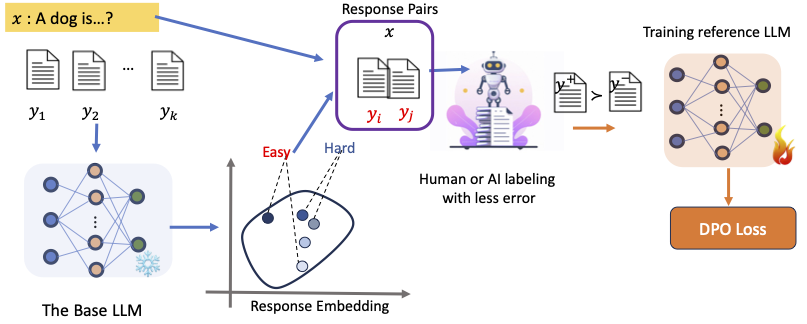

# REAL-Alignment
The code for the paper **REAL**: **R**esponse **E**mbedding-based **A**lignment for **L**LMs


## Data selection
For the given LLMs, we use it to extract the embeddings of response. We have the **(./code for data selection/hh_pair_selection.py)** and **(./code for data selection/shp_pair_selection.py)** to deal with the [HH-RLHF](https://huggingface.co/datasets/Anthropic/hh-rlhf) and [SHP2](https://huggingface.co/datasets/stanfordnlp/SHP-2) dataset.

All the sub-data (hard, easy, centroid) can be found in the [hugging face dataset](https://huggingface.co/datasets/honggen/llama2-help). 

## Supervise Fine-tuning(SFT) and DPO
We follow the setting of the [DPO paper](https://github.com/eric-mitchell/direct-preference-optimization/tree/main). We first supervised the base model using the whole preference answers and randomly sampled answers. Compared to the vanilla DPO code, we use the learning rate scheduler instead of a constant learning rate. 

For the SFT, we have the 
```bash
python -u train.py model=llama2-7b datasets=[hh] loss=sft exp_name=llama_shp_sft gradient_accumulation_steps=2 batch_size=32 eval_batch_size=32 trainer=FSDPTrainer sample_during_eval=false model.fsdp_policy_mp=bfloat16
```
After we have the SFT model, we have the DPO
```bash
python -u train.py model=llama2-7b datasets=[hh] loss=dpo loss.beta=0.1 exp_name=llama_shp-centroid gradient_accumulation_steps=2 batch_size=16 eval_batch_size=16 trainer=FSDPTrainer sample_during_eval=false model.fsdp_policy_mp=bfloat16 model.archive=/scratch/bchy/hzhang21/DPO/cache/hzhang21/llama_shp_sft/LATEST/policy.pt
```
## Response generate and evaluate
To generate the response from the dialogue, we load the models after DPO fine-tuning. **eva_generator.py** and **eva_pairs_bias.py** used to generate responses and extract the training pairs, respectively.


